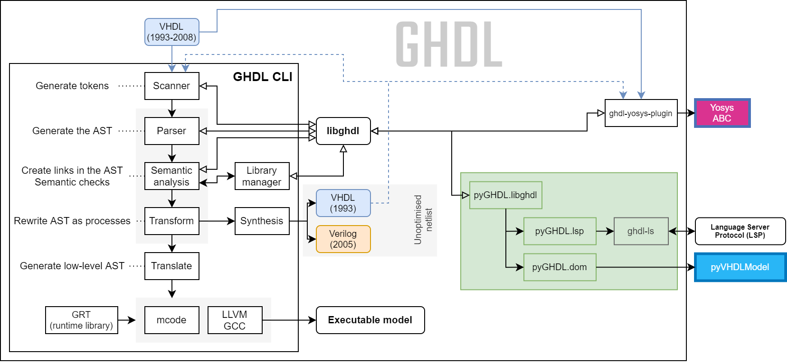

.. only:: html

   .. exec::
      from helpers import createShields
      createShields('shieldswho')

About
#####

.. _INTRO:VHDL:

What is `VHDL`?
===============

:wikipedia:`VHDL <VHDL>` is an acronym for *Verification and Hardware Description Language* (:wikipedia:`HDL <HDL>`),
which is a computer language used to describe a logic circuit by function, data flow behavior, or structure.

.. NOTE::
  Historically the 'V' in the language's acronym came from the Very High Speed Integrated Circuit (:wikipedia:`VHSIC <VHSIC>`),
  which was the U.S. government program that funded the early work on the standard.
  Changing the 'V' to mean *verification* reflects the language's increasing usage for verification as well as design.
  See `VHDL 202X PAR <http://www.eda-twiki.org/twiki/pub/P1076/PrivateDocuments/Par1076_202X.pdf>`__ via :ref:`vasg:VHDL202X`.

Although VHDL was not designed for writing general purpose programs, VHDL *is* a programming language: any algorithm can
be written with it, it can interact with files, the environment, stdin and stdout, etc.
VHDL has features similar to those found in procedural languages such as
:wikipedia:`C <C_(programming_language)>`,
:wikipedia:`Python <Python_(programming_language)>`,
or :wikipedia:`Ada <Ada_(programming_language)>`.
Indeed, VHDL derives most of its syntax and semantics from Ada. Knowing `Ada` is an advantage for learning VHDL (it is
an advantage in general as well).

However, VHDL was not designed as a general purpose language but as an `HDL`.
As the name implies, VHDL aims at modeling or documenting electronics systems.
Due to the nature of hardware components --which are always running--, VHDL is a highly concurrent language, built upon
an event-driven execution model.

Like a program written in any other language, a VHDL program can be executed.
Since VHDL is used to model designs, the term :dfn:`simulation` is often used instead of `execution`, with the same
meaning.
At the same time, like a design written in another `HDL`, a set of VHDL sources can be transformed with a
:dfn:`synthesis tool` into a netlist, that is, a detailed gate-level implementation.

The development of VHDL started in 1983 and the standard is named `IEEE <https://www.ieee.org/>`__ `1076`.
Five revisions exist:
`1987 <http://ieeexplore.ieee.org/document/26487/>`__,
`1993 <http://ieeexplore.ieee.org/document/392561/>`__,
`2002 <http://ieeexplore.ieee.org/document/1003477/>`__,
`2008 <http://ieeexplore.ieee.org/document/4772740/>`__ and
`2019 <https://ieeexplore.ieee.org/document/8938196>`__.
The standardization is handled by the :doc:`vasg:index`.
Find on-going work towards *VHDL 202X* in `gitlab.com/IEEE-P1076/VHDL-Issues <https://gitlab.com/IEEE-P1076/VHDL-Issues/-/issues>`__.

.. _INTRO:GHDL:

What is GHDL?
=============

   Architecture overview of the GHDL toolkit (CLI, libghdl, pyGHDL and ghdl-yosys-plugin).

`GHDL` is a shorthand for `G Hardware Design Language` (currently, `G` has no meaning).
It is a VHDL analyzer, compiler, simulator and (experimental) synthesizer that can process (nearly) any VHDL design.

.. NOTE::
  For almost 20 years, GHDL was *not* a synthesis tool: a netlist could not be created.
  Hence, most of the content in this documentation corresponds to the usage of GHDL as a compiler/simulator.
  See :ref:`USING:Synthesis` for further details regarding synthesis.

Unlike some other simulators, GHDL is a compiler: it directly translates a VHDL file to machine code, without using an
intermediary language such as `C` or `C++`.
Therefore, the compiled code should be faster and the analysis time should be shorter than with a compiler using an
intermediary language.

GHDL can use multiple back-ends, i.e. code generators, (`GCC <http://gcc.gnu.org/>`__, `LLVM <http://llvm.org/>`__ or
:wikipedia:`x86 <X86-64>`/:wikipedia:`i386 <Intel_80386>` only, a built-in one named *mcode*) and runs on
:wikipedia:`GNU/Linux <Linux_distribution>`, :wikipedia:`Windows <Microsoft_Windows>` |trade| and
:wikipedia:`macOS <MacOS>` |trade|; on x86, x86_64, armv6/armv7/aarch32/aarch64, ppc64, etc.

The current version of GHDL does not contain any built-in graphical viewer: signal waves cannot be seen through GHDL.
However, the behavior of the designs can still be checked through test benches and verification frameworks.
Moreover, :ref:`GHW`, :wikipedia:`VCD <Value_change_dump>` or `FST` files can be produced, which can be viewed with an
external :wikipedia:`waveform viewer <Waveform_viewer>`, such as `GtkWave <http://gtkwave.sourceforge.net/>`__.

GHDL aims at implementing VHDL as defined by `IEEE 1076 <http://ieeexplore.ieee.org/document/4772740/>`__.
It supports the
`1987 <http://ieeexplore.ieee.org/document/26487/>`__,
`1993 <http://ieeexplore.ieee.org/document/392561/>`__ and
`2002 <http://ieeexplore.ieee.org/document/1003477/>`__ revisions and, partially,
`2008 <http://ieeexplore.ieee.org/document/4772740/>`__ and
`2019 <https://ieeexplore.ieee.org/document/8938196/>`__.
:wikipedia:`Property Specification Language (PSL) <Property_Specification_Language>` is also partially supported.

Several third party projects are supported:
`Yosys <https://github.com/YosysHQ/yosys>`__
(through the `ghdl-yosys-plugin <https://github.com/ghdl/ghdl-yosys-plugin>`__)
`cocotb <https://github.com/potentialventures/cocotb>`__,
(through the :wikipedia:`VPI interface <Verilog_Procedural_Interface>`),
`VUnit <https://vunit.github.io/>`__,
`OSVVM <http://osvvm.org/>`__,
:doc:`vhdlmodel:index`,
...

.. _INTRO:WHO:

Who uses GHDL?
==============

.. container:: whouses

   .. only:: html

      +-------------------+--------------------+-----------------------------------------------------+----------------------------------------------------------------+
      | Project hub       | Documentation      | Name                                                | Brief description                                              |
      +===================+====================+=====================================================+================================================================+
      | |SHIELD:gh-poc|   | |SHIELD:rtd-poc|   | `PoC-Library <https://github.com/VLSI-EDA/PoC>`__   | A Vendor-Independent, Open-Source IP Core and Utility Library. |
      +-------------------+--------------------+-----------------------------------------------------+----------------------------------------------------------------+
      | |SHIELD:gh-vunit| | |SHIELD:doc-vunit| | `VUnit <https://vunit.github.io/>`__                | A unit testing framework for VHDL/SystemVerilog                |
      +-------------------+--------------------+-----------------------------------------------------+----------------------------------------------------------------+
      | |SHIELD:gl-p1076| | |SHIELD:tw-p1076|  | `IEEE P1076 WG <https://www.eda-twiki.org/vasg/>`__ | IEEE P1076 Working Group [VASG]                                |
      +-------------------+--------------------+-----------------------------------------------------+----------------------------------------------------------------+
      | |SHIELD:gh-tce|   | |SHIELD:doc-tce|   | `TCE <http://openasip.org/>`__                      | TTA-Based Co-Design Environment - an open-source ASIP toolset. |
      +-------------------+--------------------+-----------------------------------------------------+----------------------------------------------------------------+
