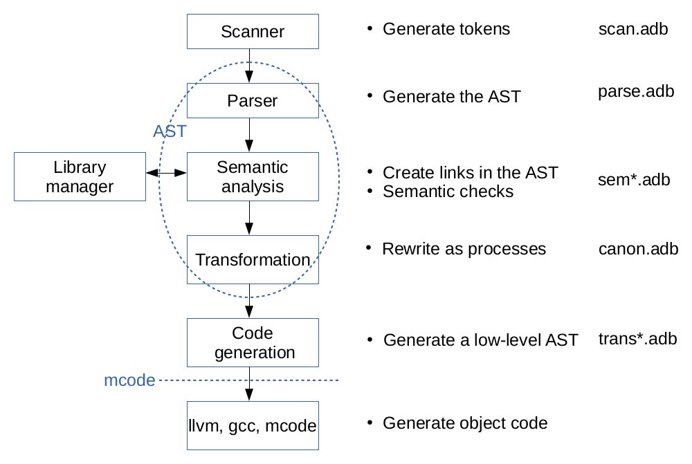

.. _INT:Overview:

Overview
########

`GHDL` is architectured like a traditionnal compiler. It has:

* a driver (sources in :ghdlsrc:`src/ghdldrv <ghdldrv>`) to call the programs (compiler, assembler, linker) if needed.

* a runtime library named GRT (sources in :ghdlsrc:`src/grt <grt>`) to help execution at run-time. This ensures that execution is cycle-accurate.

* a front-end (sources in :ghdlsrc:`src/vhdl <vhdl>`) to parse and analyse VHDL. See :ref:`INT:Frontend` and :ref:`INT:AST`.

* multiple back-ends to generate either code or netlists.

  * Three for :ref:`simulation <USING:Simulation>` (sources are in :ghdlsrc:`src/ortho <ortho>`): mcode, LLVM and GCC. See :ref:`BUILD`.
  * Two for :ref:`synthesis <USING:Synthesis>` (sources in :ghdlsrc:`src/synth <synth>`): :ref:`--synth <Synth:command>` and :ref:`Synth:plugin`.

The architecture is modular. For example, the front-end in the ``libghdl`` library is used for the language server.

The main work is performed by the front-end, which is documented in the next chapter.
